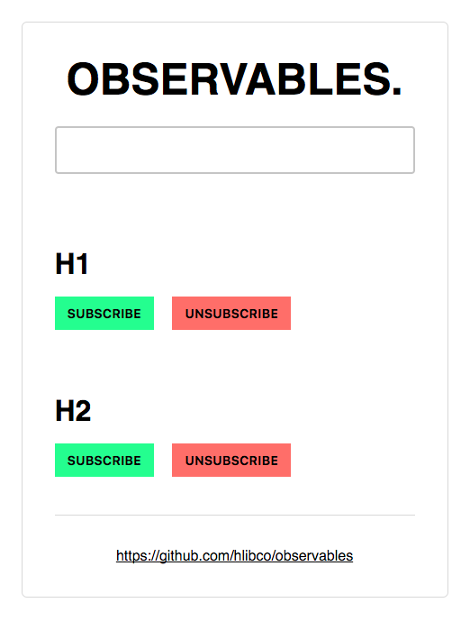

# Observables

This is an example of how to use Observables in vanilla Javascript.

---

## Use
Click on the `Subscribe` button to display the text from the `input element` in the specific area. Click on the `Unsubscribe` to stop the observable.

## Preview

